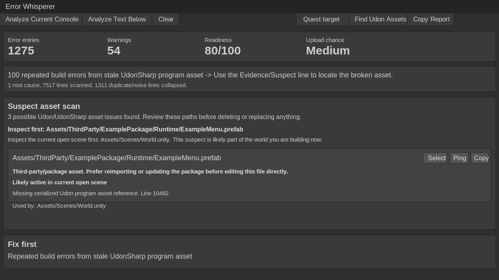

# VRChat Error Whisperer

Unity Editor alpha tool for ranking VRChat SDK, Udon, Quest, and upload issues from the Unity Console.

> Alpha advisory tool: Error Whisperer does not modify project files or guarantee a fix. Always review suspect assets, package files, and upload/support recommendations before changing a VRChat project.

## Preview

## Install

### VCC / VPM

1. Open VRChat Creator Companion.
2. Add the repository URL:

   `https://Yani-cloud7.github.io/vrchat-error-whisperer/index.json`

3. Add `VRChat Error Whisperer` to your Unity project.

### Local Package

1. Open your Unity project.
2. Open `Window > Package Manager`.
3. Click `+`.
4. Choose `Add package from disk...`.
5. Select this file:

   `Packages/com.omistaja.error-whisperer/package.json`

## Use

1. Open `Tools > VRChat Utility > Error Whisperer`.
2. Run the SDK build, upload, Quest build, or Udon compile step that fails.
3. Click `Analyze Current Console`.

The window groups duplicate console spam, ranks likely root causes, suggests what to inspect first, and shows a build readiness score.

For UdonSharp serialization spam, click `Find Udon Assets` to look for suspect serialized Udon assets and scene/prefab owners. The scan is advisory and does not modify your project.

If Unity console reflection does not work in your Unity version, paste console text into the text box and click `Analyze Text Below`.

## Notes

- The corpus is seeded from real VRChat creator failures and is still growing.
- Warnings are separated from blockers.
- Upload/support matches are intended to help prepare a support summary, not to prove a VRChat service issue.
- Third-party package assets should usually be reimported or updated before direct editing.
