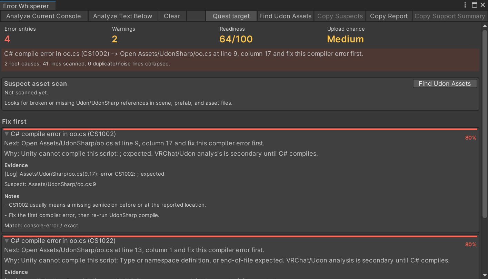

# VRChat Error Whisperer



Alpha Unity Editor tool for VRChat creators. It reads Unity Console output, ranks likely root causes, and tells you what to fix first.

> Alpha advisory tool. It does not modify your project. Always review findings before deleting, replacing, or reimporting assets.

## Install with VCC

Add this repository URL to VRChat Creator Companion:

```text
https://yani-cloud7.github.io/vrchat-error-whisperer/index.json
```

Then add `VRChat Error Whisperer` to your Unity project.

## What It Helps With

- C# and UdonSharp compiler errors
- Repeated Udon serialization spam
- Missing dependencies
- Quest, shader, and package issues
- Upload failures that may need VRChat support

## Examples

### Compiler Error

Unity Console:

```text
Assets/UdonSharp/oo.cs(9,17): error CS1002: ; expected
```

Error Whisperer:

```text
Fix first:
C# compile error in oo.cs (CS1002)

Next:
Open Assets/UdonSharp/oo.cs at line 9, column 17 and fix this compiler error first.
```

### Udon Serialization Spam

Unity Console:

```text
ArgumentNullException: Value cannot be null.
Parameter name: unityObject
VRC.Udon.Serialization.OdinSerializer.UnitySerializationUtility.SerializeUnityObject(...)
```

Error Whisperer:

```text
Fix first:
Repeated build errors from stale UdonSharp program asset

Next:
Use the suspect asset scan to locate the broken UdonBehaviour or UdonSharp program asset.
```

### Upload Support Case

Unity Console / SDK log:

```text
Build & Test succeeds but Build & Publish still fails.
Upload debugger isolates the failure after Unity bundle creation.
VRChat upload or API request fails even after local project checks pass.
```

Error Whisperer:

```text
Upload/support escalation:
Build succeeds locally, but upload appears blocked by account, blueprint, world, or backend state.

Next:
Copy the support summary and include blueprint ID, world ID, account name, SDK log, and approximate upload time.
```

## Status

This is an alpha prototype. The goal is not to detect every error. The goal is to help creators ignore noise and fix the first meaningful blocker.

